# Sample(example) of PlantUML 
- PlantUML sample/example

## PlantUML
- http://plantuml.com/
- https://www.patreon.com/plantuml

## Sample

### file1

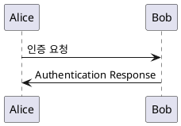

### file2

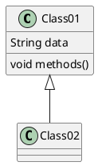

### file3

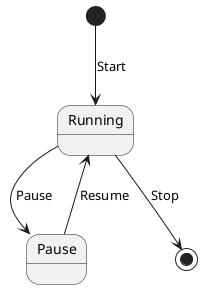

### file4

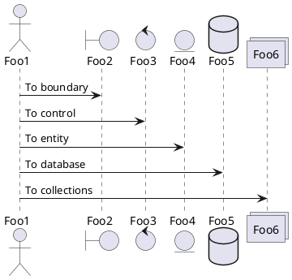

### file5

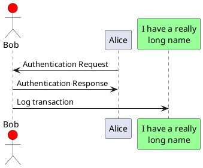

### file6

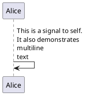

### file7

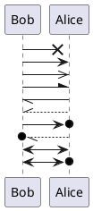

### file8

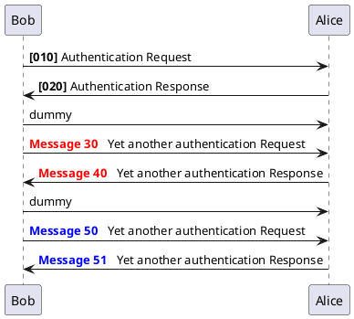

### file9

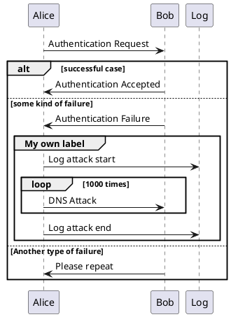

### fileA

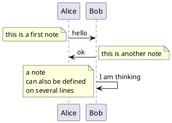

### fileB

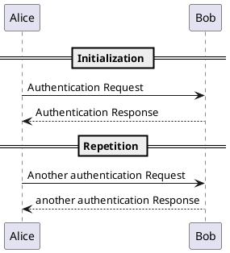

### fileC

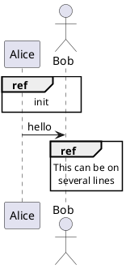

