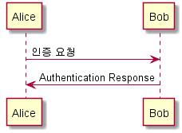
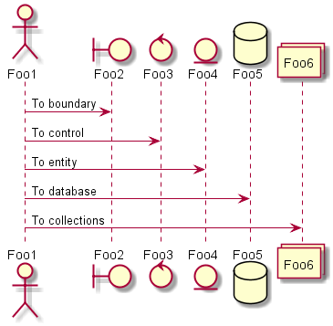
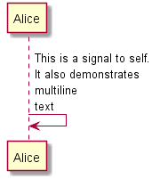
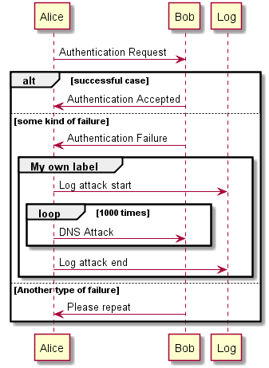
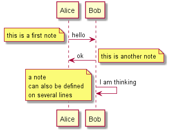
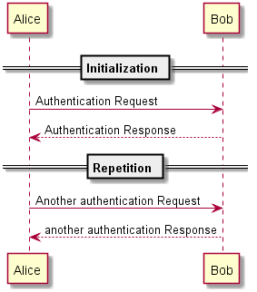

# Sample(example) of PlantUML 
- PlantUML sample/example

## PlantUML
- http://plantuml.com/
- https://www.patreon.com/plantuml

## Sample

### file1

### file2

### file3

### file4

### file5

### file6

### file7

### file8

### file9

### fileA

### fileB

### fileC

