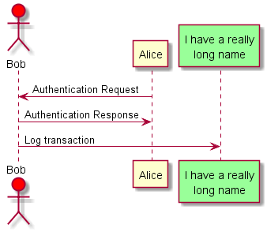
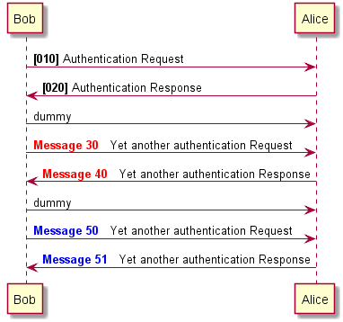
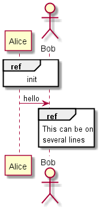

# Sample(example) of PlantUML 
- PlantUML sample/example
# PlantUML
- http://plantuml.com/
- https://www.patreon.com/plantuml
# Sample
- 
```
@startuml 
Alice -> Bob: 인증 요청
Alice <- Bob: Authentication Response 
@enduml
```
- 
```
@startuml
class Class01 {
  String data
  void methods()
}
Class01 <|-- Class02
@enduml
```
- 
```
@startuml
[*] --> Running: Start
Running --> Pause: Pause
Pause --> Running: Resume
Running --> [*]: Stop
@enduml
```
- 
```
@startuml
actor Foo1
boundary Foo2
control Foo3
entity Foo4
database Foo5
collections Foo6
Foo1 -> Foo2 : To boundary
Foo1 -> Foo3 : To control
Foo1 -> Foo4 : To entity
Foo1 -> Foo5 : To database
Foo1 -> Foo6 : To collections
@enduml
```
- 
```
@startuml
actor Bob #red
' The only difference between actor
'and participant is the drawing
participant Alice
participant "I have a really\nlong name" as L #99FF99
/' You can also declare:
   participant L as "I have a really\nlong name"  #99FF99
  '/

Alice->Bob: Authentication Request
Bob->Alice: Authentication Response
Bob->L: Log transaction
@enduml
```
- 
```
@startuml
Alice->Alice: This is a signal to self.\nIt also demonstrates\nmultiline \ntext
@enduml
```
- 
```
@startuml
Bob ->x Alice
Bob -> Alice
Bob ->> Alice
Bob -\ Alice
Bob \\- Alice
Bob //-- Alice

Bob ->o Alice
Bob o\\-- Alice

Bob <-> Alice
Bob <->o Alice
@enduml
```
- 
```
@startuml
autonumber 10 10 "<b>[000]"
Bob -> Alice : Authentication Request
Bob <- Alice : Authentication Response

autonumber stop
Bob -> Alice : dummy

autonumber resume "<font color=red><b>Message 0  "
Bob -> Alice : Yet another authentication Request
Bob <- Alice : Yet another authentication Response

autonumber stop
Bob -> Alice : dummy

autonumber resume 1 "<font color=blue><b>Message 0  "
Bob -> Alice : Yet another authentication Request
Bob <- Alice : Yet another authentication Response
@enduml
```
- 
```
@startuml
Alice -> Bob: Authentication Request

alt successful case

    Bob -> Alice: Authentication Accepted
    
else some kind of failure

    Bob -> Alice: Authentication Failure
    group My own label
    	Alice -> Log : Log attack start
        loop 1000 times
            Alice -> Bob: DNS Attack
        end
    	Alice -> Log : Log attack end
    end
    
else Another type of failure

   Bob -> Alice: Please repeat
   
end
@enduml
```
- 
```
@startuml
Alice->Bob : hello
note left: this is a first note

Bob->Alice : ok
note right: this is another note

Bob->Bob : I am thinking
note left
	a note
	can also be defined
	on several lines
end note
@enduml
```
- 
```
@startuml

== Initialization ==

Alice -> Bob: Authentication Request
Bob --> Alice: Authentication Response

== Repetition ==

Alice -> Bob: Another authentication Request
Alice <-- Bob: another authentication Response

@enduml
```
- 
```
@startuml
participant Alice
actor Bob

ref over Alice, Bob : init

Alice -> Bob : hello

ref over Bob
  This can be on
  several lines
end ref
@enduml
```

